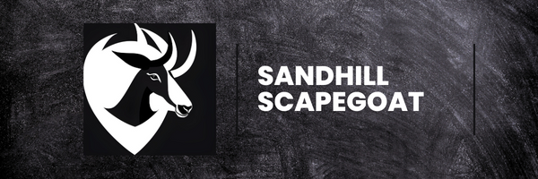

# SandhillScapegoat - Cybersecurity & Privacy Blog

Welcome to the SandhillScapegoat Cybersecurity & Privacy Blog repository. This blog is dedicated to exploring the fascinating world of cybersecurity, privacy, and identity management. Here, you'll find articles, tutorials, and insights on topics that matter in the digital realm.

<!--
## Table of Contents

- [About](#about)
- [Blog Categories](#blog-categories)
- [Blog Highlights](#blog-highlights)
- [Social Media](#social-media)
- [Contributions](#contributions)
- [License](#license)
-->
## About

Hi! I am Sebastian Gomez-Duranona, and this is my blog SandhillScapegoat. I am a Computer Science student based in Omaha, Nebraska. Throughout my student and professional career, I have been able to work with several companies in the space of Fraud Prevention, Identity Verification, and Trust and Safety. These experiences, as well as growing up in the World of Information, have planted a seed of curiosity and discomfort in the way digital identity is managed today. I firmly believe that it is imperative for all of us who share a space in this interconnected world to think hard about our identities inside and outside the online world. This is why I decided to launch SandhillScapegoat, an online persona and blog that will allow me to explore these topics in order to (hopefully) bring more clarity into the online landscape.

## Blog Categories

Explore a wide range of cybersecurity and privacy topics, including:

- **Identity Management**: Learn about decentralized identity systems, user authentication, and identity theft prevention.
- **Privacy Matters**: Discover ways to protect your digital privacy, from encryption to secure communication tools.
- **Threat Intelligence**: Stay updated on emerging threats, vulnerabilities, and cybersecurity trends.
- **Tutorials**: Step-by-step guides to secure your online presence and understand cybersecurity concepts.

<!--
## Blog Highlights

- [**Title of a Blog Post 1**](link-to-blog-post-1): A brief description of the first highlight.
- [**Title of a Blog Post 2**](link-to-blog-post-2): A brief description of the second highlight.
- [**Title of a Blog Post 3**](link-to-blog-post-3): A brief description of the third highlight.
-->
## Social Media

Stay connected with SandhillScapegoat on social media for the latest updates, discussions, and cybersecurity insights:

- **Twitter**: [@SandhillScapegoat](link-to-twitter)
- **Instagram**: [@SandhillScapegoat](link-to-instagram)

## Contributions

Contributions are welcome! If you have valuable insights, articles, or ideas related to cybersecurity, privacy, or identity management, please feel free to contribute to this blog. Submit a pull request, and let's make the digital world safer together.

## License

This blog is licensed under the [Creative Commons Attribution 4.0 International License](link-to-license). Feel free to share and adapt the content while providing appropriate attribution.

Happy reading and stay secure in the digital realm!
